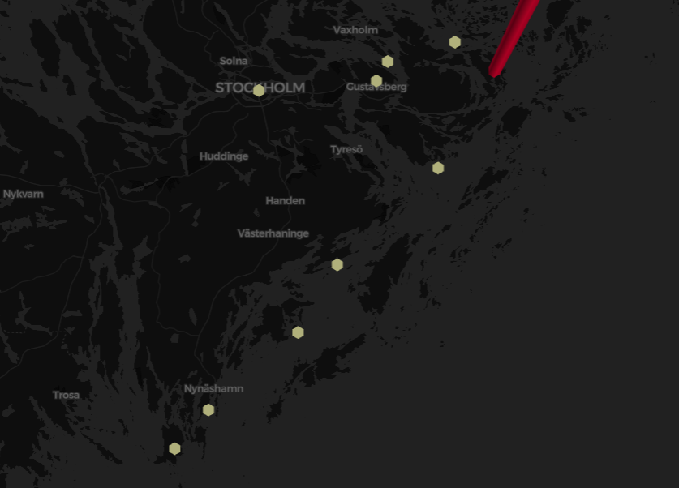

# drone-docking-network
[](https://github.com/nalindas9/drone-docking-network/blob/main/LICENSE)

Find shortest route for drone docking network 

## Overview

This algorithm builds the shortest route such that a drone can hop from dock to dock from Stockholm to Torö. [OpenStreetMap](https://en.wikipedia.org/wiki/OpenStreetMap) was used to obtain the lighthouses geographic data in the region and [pydeck](https://deckgl.readthedocs.io/en/latest/) was used to plot the final route taken by the drone. 

## Output



## Dependencies

The following dependencies are required to run this package:

1. Google Colab
2. pydeck
3. OSMPythonTools
4. geopy 

## Running Simulation
Code is in ``` drone_lighthouse_network.ipynb ``` which can be imported into Google Colab

## Approach
Part 1:
1.  In this approach, first all of the lighthouses coordinates (longitude, latitude) available in Sweden was obtained in a csv file (lighthouse.csv) using OSM API 
2.  From the obtained coordinates, the optimal coordinates which were closest to the path along the route of Stockholm east to Vindö and then southwest to Torö were stored in a seperate csv file (optimal_lighthouse.csv)
3. These optimal points are then plotted on a top view of the map using pydeck

Part 2:
1. From these optimal points, the final route is obtained using the drone battery life and speed information and stored in a seperate csv file.(route.csv)
2. The final route is plotted on the map. HexagonLayer type is used for visualization.
3. Total route distance is calculated

Part 3:
1.   Calculated total time to fill up docks using battery life and speed information of drones and time to charge
