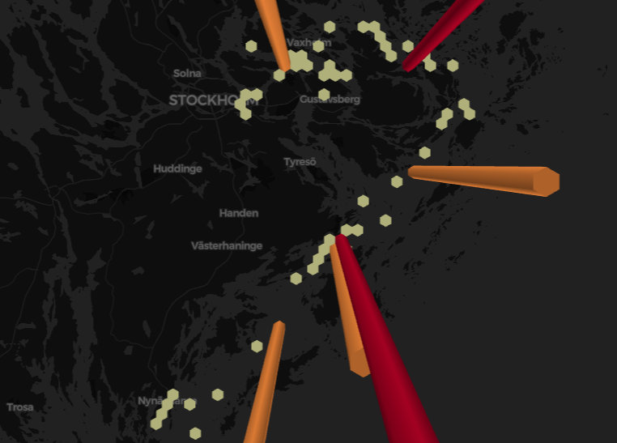

# drone-docking-network

Code is in ``` drone_lighthouse_network.ipynb ``` which can be imported into Google Colab



Part 1:
1.  In this approach, first all of the lighthouses coordinates (longitude, latitude) available in Sweden was obtained in a csv file (lighthouse.csv) using OSM API 
2.  From the obtained coordinates, the optimal coordinates which were closest to the path along the route of Stockholm east to Vindö and then southwest to Torö were stored in a seperate csv file (optimal_lighthouse.csv)
3. These optimal points are then plotted on a top view of the map using pydeck

Part 2:
1. From these optimal points, the final route is obtained using the drone battery life and speed information and stored in a seperate csv file.(route.csv)
2. The final route is plotted on the map. HexagonLayer type is used for visualization.
3. Total route distance is calculated

Part 3:
1.   Calculated total time to fill up docks using battery life and speed information of drones and time to charge
